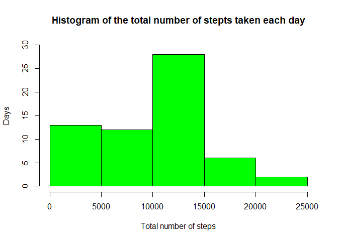
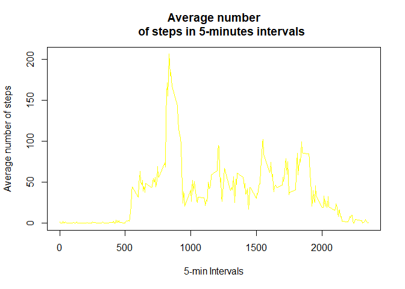
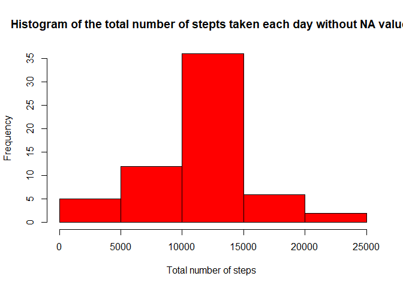
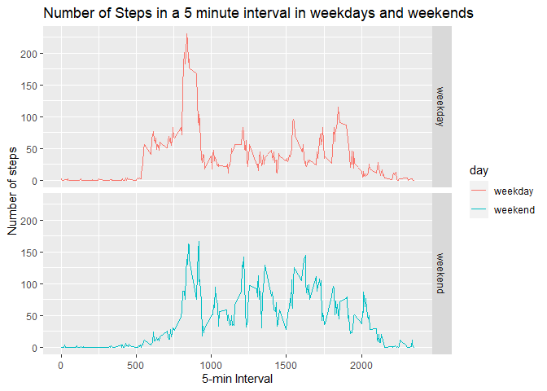

## Loading and preprocessing the data
#### 1. Unzipping and Loading the data, and loading the neccesary packages

```r
library(dplyr)
library(ggplot2)
if(!file.exists("activity.csv"))
    unzip("activity.zip")
activityData <- read.csv("activity.csv")
```

-----

## What is mean total number of steps taken per day?
#### 1. Getting the number of steps per day

```r
stepsday <- activityData %>%
          group_by(date) %>%
          summarise(steps = sum(steps,na.rm=TRUE))
```

#### 2. Histogram of the numbers of steps per day

```r
hist(stepsday$steps,xlab="Total number of steps",ylab="Days"
     ,main ="Histogram of the total number of stepts taken each day",col="green",ylim=c(0,30))
```

<!-- -->

#### 3. Total mean and median of steps per day

```r
meanStepsbyDay <- round(mean(stepsday$steps),digits=2)
medianStepsbyDay <- median(stepsday$steps)
```
* The mean is: 9354.23
* The median is: 10395

-----

## What is the average daily activity pattern?
#### 1. Getting the number of steps per interval

```r
stepsInterval <- activityData %>%
            group_by(interval)%>%
            summarise(meansteps=mean(steps,na.rm = TRUE))
```

#### 2. Plot of the number of steps per interval

```r
plot(stepsInterval$meansteps ~ stepsInterval$interval,col="yellow", type="l",
     xlab="5-min Intervals",ylab="Average number of steps",main="Average number
     of steps in 5-minutes intervals")
```

<!-- -->

#### 3. Getting the interval with the maximum number of steps

```r
intervalMaxSteps <- stepsInterval[which.max(stepsInterval$meansteps),]
```
* The interval with the maximum steps is: 835

-----

## Imputing missing values
#### 1. Getting the total number of missing values

```r
naValues <- sum(is.na(activityData$steps))
```
* Total missing values: 2304

#### 2. Creating a new dataset and replacing the NA values with the mean in the interval

```r
noNAData <- activityData
for(i in 1:nrow(activityData)){
      if(is.na(activityData$steps[i])){
            noNAData$steps[i] <- stepsInterval$meansteps[
              noNAData$interval[i]==stepsInterval$interval]
      }
}
```

#### 3. Getting the number of steps per day with the NA values replaced

```r
noNAstepsday <- noNAData %>%
          group_by(date) %>%
          summarise(steps = sum(steps,na.rm=TRUE))
```

#### 4. Histogram of the number of steps per day with the NA values replaced

```r
hist(noNAstepsday$steps,xlab="Total number of steps ",
     main ="Histogram of the total number of stepts taken each day without NA values",col="red")
```

<!-- -->

#### 5. Getting the new mean and median without the NA values

```r
newMean <- format(mean(noNAstepsday$steps),scientific = FALSE)
newMedian <- format(median(noNAstepsday$steps),scientific = FALSE)
```
* The new mean is: 10766.19
* The new median is: 10766.19

-----
 
## Are there differences in activity patterns between weekdays and weekends?

#### 1. Creating a new factor variable with two levels **weekday** and **weekend** indicating whether a given date is a weekday or weekend day

```r
diasData <- noNAData
diasData$date <- as.Date(diasData$date)
diasData$day <- ifelse(weekdays(diasData$date) %in% c("sábado","domingo"),"weekend","weekday")
diasData$day <- as.factor(diasData$day)
```

#### 2. Plot with de number of steps in a 5-minute interval per weekday and weekend

```r
meanData <- aggregate(steps ~ interval + day, data=diasData, mean)
ggplot(meanData, aes(interval,steps,color=day))+
  geom_line()+facet_grid(day~.)+
  labs(x="5-min Interval",y="Number of steps") + 
  ggtitle("Number of Steps in a 5 minute interval in weekdays and weekends")
```

<!-- -->
