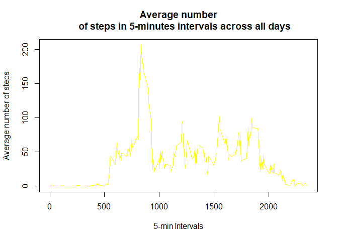
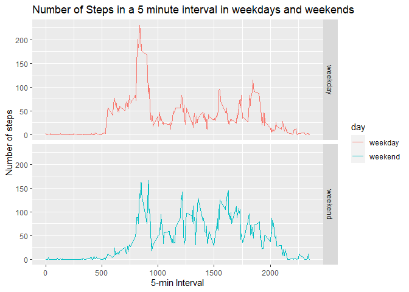

#Reproducible Research

## Loading and preprocessing the data
####1. Unzipping and Loading the data

```r
library(dplyr)
```

```
## 
## Attaching package: 'dplyr'
```

```
## The following objects are masked from 'package:stats':
## 
##     filter, lag
```

```
## The following objects are masked from 'package:base':
## 
##     intersect, setdiff, setequal, union
```

```r
library(ggplot2)
if(!file.exists("activity.csv"))
    unzip("activity.zip")
activityData <- read.csv("activity.csv")
```

## What is mean total number of steps taken per day?
####1. Getting the number of steps per day

```r
stepsday <- activityData %>%
          group_by(date) %>%
          summarise(steps = sum(steps,na.rm=TRUE))
```

```
## `summarise()` ungrouping output (override with `.groups` argument)
```

####2. Histogram of the numbers of steps per day

```r
hist(stepsday$steps,xlab="Total number of steps",ylab="Days"
     ,main ="Histogram of the total number of stepts taken each day",col="green",ylim=c(0,30))
```

<!-- -->

####3. Total mean and median of steps per day

```r
meanStepsbyDay <- mean(stepsday$steps)
medianStepsbyDay <- median(stepsday$steps)
```
* The mean is: 9354.2295082
* The median is: 10395

## What is the average daily activity pattern?

```r
stepsInterval <- activityData %>%
            group_by(interval)%>%
            summarise(meansteps=mean(steps,na.rm = TRUE))
```

```
## `summarise()` ungrouping output (override with `.groups` argument)
```

```r
plot(stepsInterval$meansteps ~ stepsInterval$interval,col="yellow", type="l",
     xlab="5-min Intervals",ylab="Average number of steps",main="Average number
     of steps in 5-minutes intervals across all days")
```

<!-- -->

```r
intervalMaxSteps <- stepsInterval[which.max(stepsInterval$meansteps),]
```


## Imputing missing values

```r
naValues <- sum(is.na(activityData$steps))

noNAData <- activityData

for(i in 1:nrow(activityData)){
      if(is.na(activityData$steps[i])){
            noNAData$steps[i] <- stepsInterval$meansteps[
              noNAData$interval[i]==stepsInterval$interval]
      }
}

noNAstepsday <- noNAData %>%
          group_by(date) %>%
          summarise(steps = sum(steps,na.rm=TRUE))
```

```
## `summarise()` ungrouping output (override with `.groups` argument)
```

```r
hist(noNAstepsday$steps,xlab="Total number of steps ",
     main ="Histogram of the total number of stepts taken each day without NA values",col="red")
```

<!-- -->

```r
mean(noNAstepsday$steps)
```

```
## [1] 10766.19
```

```r
median(noNAstepsday$steps)
```

```
## [1] 10766.19
```


## Are there differences in activity patterns between weekdays and weekends?

```r
diasData <- noNAData

diasData$date <- as.Date(diasData$date)
diasData$day <- ifelse(weekdays(diasData$date) %in% c("sábado","domingo"),"weekend","weekday")
diasData$day <- as.factor(diasData$day)

meanData <- aggregate(steps ~ interval + day, data=diasData, mean)

ggplot(meanData, aes(interval,steps,color=day))+
  geom_line()+facet_grid(day~.)+
  labs(x="5-min Interval",y="Number of steps") + 
  ggtitle("Number of Steps in a 5 minute interval in weekdays and weekends")
```

<!-- -->
